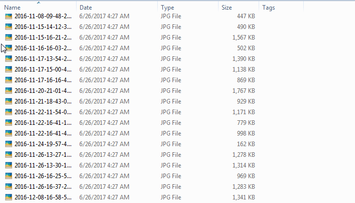

## Command Line Tool- Remove Exif Data With Ease
This tool is made in Python 2.7 compiled using pyinstaller for Windows OS. Nothing is special about this tool it just ease the work for me, maybe will for you too
#### For what reason  ?
> Exif is `Metadata` stored in hidden in your pictures. Many well-intentioned people unwittingly `expose personal information` that is embedded in the metadata of those digital pictures. To better protect your online `confidentiality`, it is crucial to remove exif data. 

## Installation instructions

* Download the .zip file [exif_remove.zip](https://codeload.github.com/roothaxor/Exif-Remove/zip/master) 
* Extract the .zip file and copy the `exif.exe` to `C:\Windows\`
* Lets test it! Goto the directory where you have your pictures
* Hold `SHIFT KEY` and click `RIGHT CLICK`
* From dropdown select `Open command window here`
* Write `exif` and press `ENTER KEY`
> It'll regenerate the image files without exif data and save them, also auto delete the files with exif data

### In work !

  

